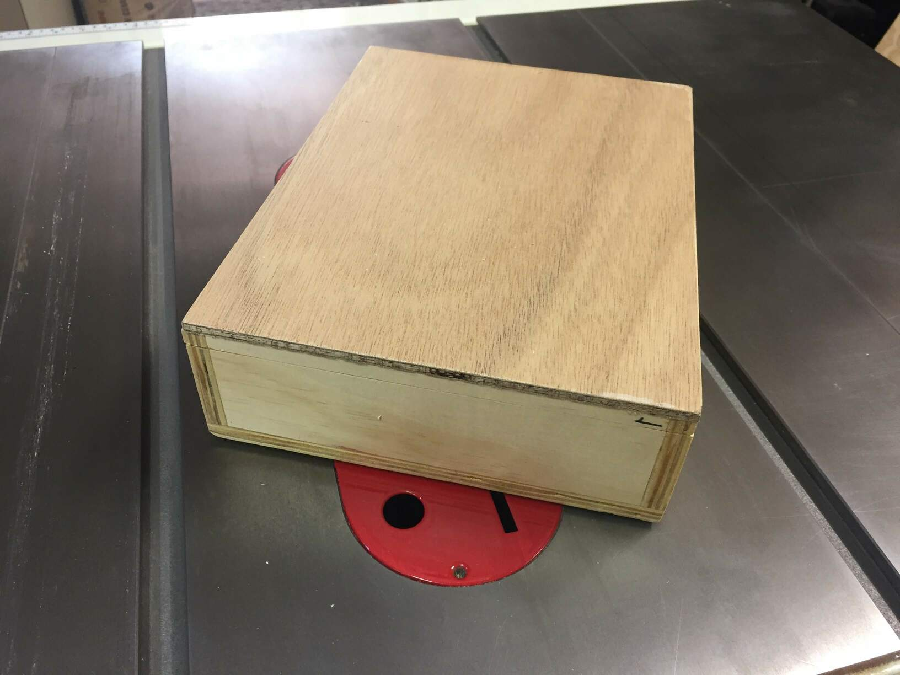
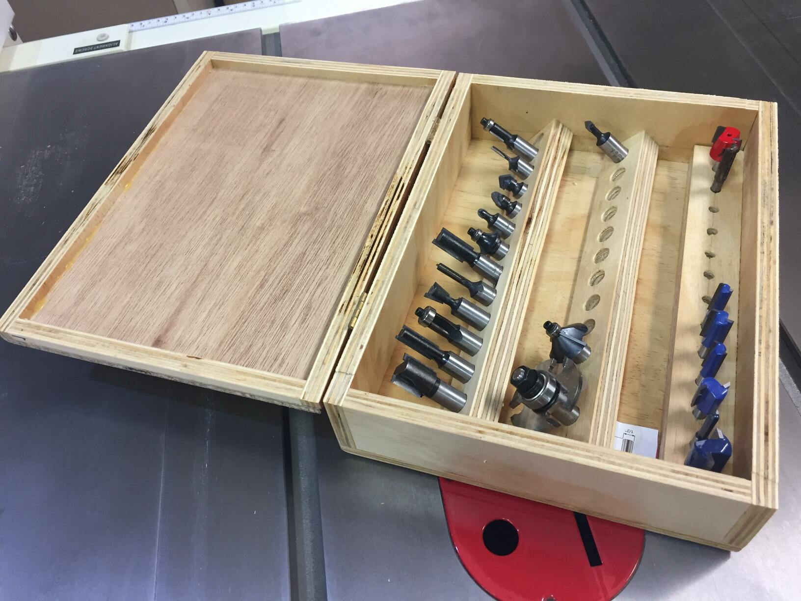

# Routerbit Box

 

 

# Notes

Box: 295x255x80 12mm ply

Bit holder strips: 19mm ply, 45° bevel.

Box sides (80mm) made from existing 80mm scraps, if made to fit make that 120mm
and bit holders upright for more compact design. As it is its nice for removal
of bits, which may be less easy if all bits were stored vertical.
